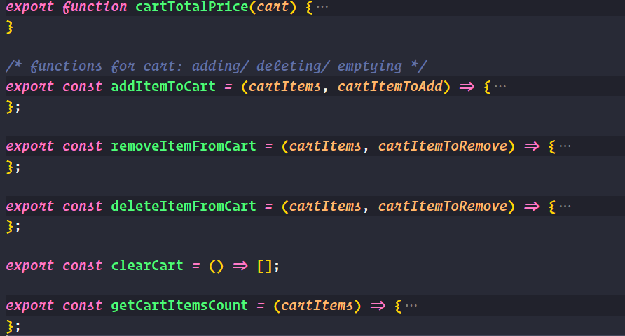

# JS3 Group Assignment - E-Commerce Shop

[Demo-live-version](https://mrmisc-live.herokuapp.com/)

#### Name: Mr Misc

## Tools and etc
- create-react-app
- React-router-dom
- [React Icons](https://react-icons.github.io/react-icons/)
- hooks (useState, useEffect, useContext, useRef, useParams...)
- eslint
- prettier
- heroku

## !Important
`npm install` to get everything work for the very first time.

## context & useContext

Create a globalContext to store fetched data and cart related useState variables.

Then BrowserRouter and its children are wrapped inside this globalComponent, so they can get access to these value (i.e. products, cart, etc.).

Whenever we need to use these data which are stored in globalContext, we take that/these specific pieces of data out and use them to build our own components by passing them dowm as props or use them directly in that component.

All JavaScript functions are stored inside of this utilities.js file to make our folder structure clear and neat.

